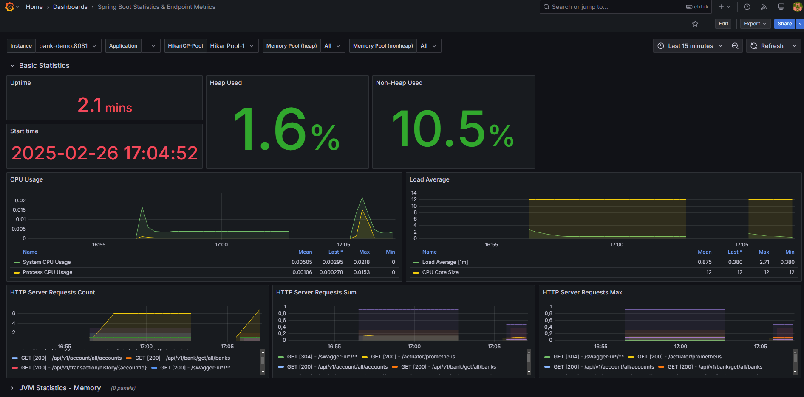
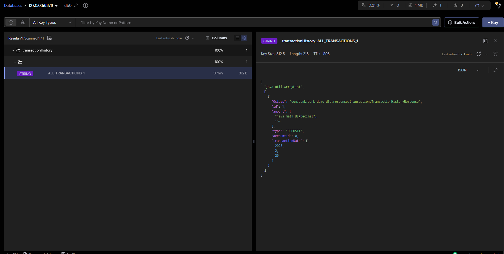

# Bankacılık Sistemi API

## Proje Açıklaması

Bu proje, temel bankacılık işlemlerini gerçekleştirebilen bir API'dir. Uygulama, hesap yaratma, hesaba para yatırma, hesaptan para çekme, hesap bakiyesi sorgulama ve işlem tarihçesi sorgulama gibi işlevleri sağlar.

### Retry Mekanizması ve Pessimistic Lock Kullanımı

Projede, özellikle yüksek eşzamanlı işlemlerin olduğu durumlarda veri tutarlılığını sağlamak amacıyla **pessimistic locking** ve **retry mekanizması** kullanılmaktadır.

#### Pessimistic Locking
Hesap güncelleme işlemlerinde, veri tutarsızlıklarını önlemek amacıyla **pessimistic locking** uygulanmıştır. Bu mekanizma sayesinde, bir işlem sırasında bir hesaba ait kaynağın kilitlenmesi sağlanır, böylece başka bir işlem aynı anda bu veriyi değiştiremez. Bu, özellikle yüksek miktarda para çekme veya yatırma işlemlerinin yapıldığı durumlarda veri bütünlüğünü korur.

## Kullanılan Teknolojiler

- **Java 17**: Backend geliştirme için ana dil olarak kullanılmıştır.
- **Redis**: Verilerin önbelleğe alınması için kullanılır, sistemin performansını artırmak amacıyla tercih edilmiştir.
- **Prometheus**: Sistemin izlenmesi için metrik toplama aracı olarak kullanılır.
- **Grafana**: Prometheus ile toplanan verilerin görselleştirilmesi için kullanılır.
- **Docker**: Uygulamanın konteynerize edilmesi amacıyla kullanılır.
- **PostgreSQL**: Veritabanı olarak kullanılmıştır.

## Proje Görselleri 
- Grafana
  
- Redis Cache
  
## Uygulamada Olan Nesneler

### 1. Hesap Sahibi (AccountHolder)
Hesap sahibi, bankada hesap açabilen gerçek veya tüzel kişiyi temsil eder. Her hesap sahibi birden fazla hesaba sahip olabilir.

### 2. Hesap (Account)
Hesap, bankada açılan hesapları temsil eder. Her hesap, bir hesap sahibine bağlıdır ve bakiyesi ile yapılan işlemleri içerir.

### 3. İşlem (Transaction)
İşlem, hesaplarda gerçekleştirilen para yatırma, para çekme ve diğer işlemleri temsil eder. Her işlem, işlem türü, işlem tutarı ve işlem zamanını içerir.

### 4. Banka (Bank)
Banka, sisteme ait bankaları temsil eder. Bir banka, birden fazla hesap sahibine ve hesaba sahip işlemlere sahiptir.
# API Uç Noktaları
## Swagger Link 
http://localhost:8081/swagger-ui/index.html
## Account Controller

- **POST** `/api/v1/account/create/account`  
  Hesap yaratma  
  **Body:** `CreateAccountRequest`

- **GET** `/api/v1/account/account/balance/{accountId}`  
  Hesap bakiyesi sorgulama  
  **Path Variable:** `accountId`

- **GET** `/api/v1/account/account/customer/{accountHolderId}`  
  Hesapları hesap sahibine göre listeleme  
  **Path Variable:** `accountHolderId`

- **GET** `/api/v1/account/all/accounts`  
  Tüm hesapları listeleme

- **DELETE** `/api/v1/account/delete/account/{accountId}`  
  Hesap silme  
  **Path Variable:** `accountId`

## AccountHolder Controller

- **POST** `/api/v1/accountHolder/create/accountHolder`  
  Hesap sahibi yaratma  
  **Body:** `CreateAccountHolderRequest`

- **PUT** `/api/v1/accountHolder/update/{id}`  
  Hesap sahibi güncelleme  
  **Path Variable:** `id`  
  **Body:** `UpdateAccountHolderRequest`

- **GET** `/api/v1/accountHolder/get/{id}`  
  Hesap sahibinin bilgilerini getirme  
  **Path Variable:** `id`

- **GET** `/api/v1/accountHolder/all`  
  Tüm hesap sahiplerini listeleme

- **DELETE** `/api/v1/accountHolder/delete/accountHolder/{accountHolderId}`  
  Hesap sahibi silme  
  **Path Variable:** `accountHolderId`


### 3. Bank Controller

- **POST** `/api/v1/bank`  
  Banka oluşturma  
  **Body:** `CreateBankRequest`

- **PUT** `/api/v1/bank/{id}`  
  Banka güncelleme  
  **Path Variable:** `id`  
  **Body:** `UpdateBankRequest`

- **GET** `/api/v1/bank/{id}`  
  Banka bilgilerini getirme  
  **Path Variable:** `id`

- **GET** `/api/v1/bank`  
  Tüm bankaları listeleme

- **DELETE** `/api/v1/bank/{id}`  
  Banka silme  
  **Path Variable:** `id`

### 4. Transaction Controller

- **POST** `/api/v1/transaction/deposit`  
  Hesaba para yatırma  
  **Body:** `TransactionDepositRequest`

- **POST** `/api/v1/transaction/withdrawal`  
  Hesaptan para çekme  
  **Body:** `TransactionWithdrawalRequest`

- **GET** `/api/v1/transaction/history/{accountId}`  
  İşlem tarihçesi sorgulama  
  **Path Variable:** `accountId`  
  **Query Parameters:**
  - `startDate`: Başlangıç tarihi (format: dd/MM/yyyy)
  - `endDate`: Bitiş tarihi (format: dd/MM/yyyy)


## Projeyi Çalıştırma

Projeyi yerel bilgisayarınızda çalıştırmak için aşağıdaki adımları izleyebilirsiniz.

### 1. Projeyi Klonlayın

Öncelikle projeyi GitHub'dan klonlayın:

```bash
git clone https://github.com/oguzhansecgel/demo-bank.git
cd demo-bank 
``` 

### 2. Bağımlılıkları Yükleyin
Maven kullanarak projedeki bağımlılıkları yükleyin:

```bash
git clone https://github.com/oguzhansecgel/demo-bank.git
./mvnw clean install
``` 

### 3. Docker ile Çalıştırma
Docker kullanarak projeyi çalıştırmak için şu komutu kullanabilirsiniz:

```bash
docker-compose up
``` 
Proje başarıyla çalıştığında API'ye http://localhost:8081 adresinden erişebilirsiniz.
